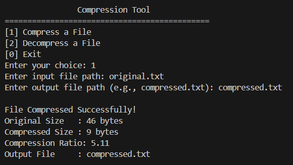
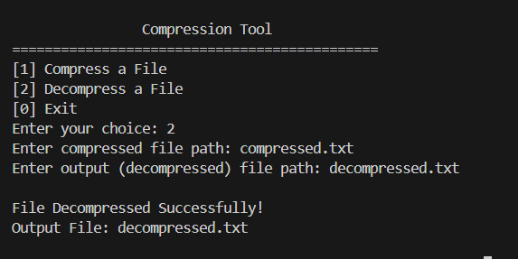

# Compression Tool in C

- **Name:** `SONAM KUMARI`  
- **Company:** `CODTECH IT SOLUTIONS`  
- **ID:** `CITS0D586`  
- **Domain:** `C Programming`  
- **Internship Duration:**  `June 14th, 2025` – `July 14th, 2025`
 

---

##  Project Overview

This project is a **Run-Length Encoding (RLE) based compression and decompression tool** implemented in C. It allows users to compress and decompress text files by reducing sequences of repeated characters. It also compares the original and compressed file sizes and only keeps the compressed file if it's effective.

---

## Screenshots

  <table>
    <tr>
      <td></td>
      <td></td>
    </tr>
  </table>

---
##  Features

- Compress any plain text file using **Run-Length Encoding (RLE)**
- Decompress previously compressed files
- Reports original and compressed file sizes
- Automatically discards the compressed file if it's larger or equal in size
- Simple and interactive CLI interface

---

# Tech Used
> C Language

